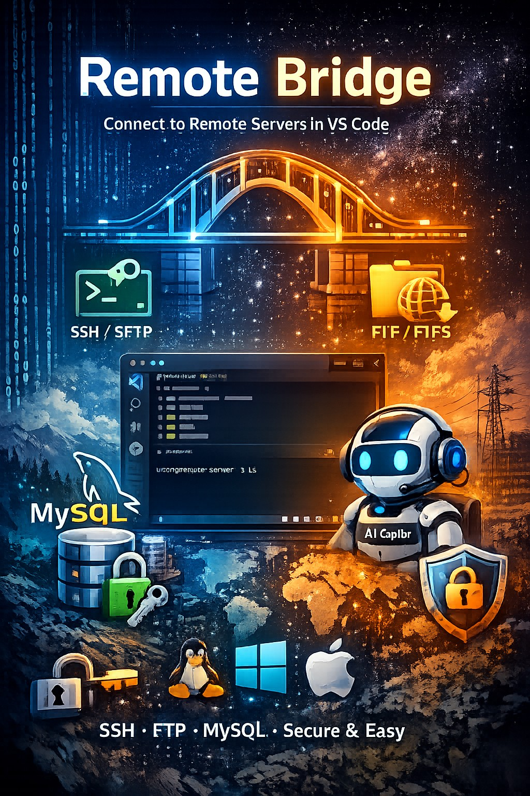

# Remote Bridge

[](https://marketplace.visualstudio.com/items?itemName=DavidLouda.remote-bridge)
[](LICENSE)

Work with remote file systems over **SSH**, **SFTP**, **FTP**, and **FTPS** directly in VS Code — as if they were local.



## Overview

| | |
|---|---|
| **Protocols** | SSH, SFTP, FTP, FTPS |
| **Auth** | Password, private key (PPK/PEM), SSH agent, FTPS/TLS |
| **File system** | Native VS Code Explorer integration — open remote folders as workspace folders |
| **Terminal** | Interactive SSH shell with full PTY and window resize support |
| **Connection manager** | Folders, drag & drop, multi-select, duplicate, import from `~/.ssh/config` / WinSCP / SSH FS |
| **Security** | Passwords in VS Code SecretStorage; optional AES-256-GCM master password with auto-lock |
| **MySQL / MariaDB** | Query, modify, and inspect remote databases via SSH — no local drivers needed |
| **AI (Copilot)** | `@remote` chat participant + 15 LM tools for file operations, shell commands, and SQL |
| **Multi-OS** | Per-connection OS setting — Linux, macOS, Windows (PowerShell) |
| **Localization** | 12 languages: EN, CS, DE, FR, ES, PL, HU, SK, UK, ZH-CN, KO, JA |

## Features

### 🔌 Multi-Protocol Support
- **SSH / SFTP** — Full file system access, terminal, command execution, and MySQL database operations via `ssh2`
- **FTP / FTPS** — Secure and plain FTP file browsing and transfers via `basic-ftp`

### 🖥️ Multi-OS Support
- Each connection has an **Operating System** setting — **Linux** (default), **macOS**, or **Windows**
- All shell commands (`stat`, `grep`, `find`, `cp`, `rm`, file read/write, MySQL…) are automatically adapted to the target OS
- Linux & macOS use POSIX tools; Windows uses PowerShell equivalents (`Get-ChildItem`, `Select-String`, `Copy-Item`, etc.)
- Centralized in a single `shellCommands` module — easy to extend

### 📂 Native VS Code Integration
- Open remote directories as **workspace folders** — use the built-in Explorer, Search, and Editor
- Connecting to a server automatically creates a named **`.code-workspace` file** and opens it — the window title shows the server hostname (e.g. `example.com (Workspace)`)
- When VS Code reopens the workspace file, **auto-reconnect** re-establishes the connection transparently
- `FileSystemProvider` on the `remote-bridge://` scheme — transparent to all VS Code features
- File content and directory listing **cache** with configurable TTL
- **Connection pooling** with idle timeout for optimal performance

### 🗂 Connection Manager
- Organize connections into **folders** with drag-and-drop support
- **Multi-select** connections for bulk **delete** or **Move to Folder**
- **Duplicate**, **edit**, and **delete** connections from the sidebar
- **Import** from:
  - `~/.ssh/config`
  - WinSCP (including encrypted passwords with master password)
  - SSH FS VS Code extension

### 🔐 Security
- Individual passwords stored securely in **VS Code SecretStorage**
- Optional **master password** to encrypt the entire connection store (AES-256-GCM + PBKDF2)
- Auto-lock after configurable timeout

### 🖥️ SSH Terminal
- Open an **interactive SSH shell** directly in the VS Code integrated terminal
- Full PTY support with window resizing

### 🤖 AI Integration (GitHub Copilot)

Chat participant `@remote` with commands:
- `/connect` — Connect to a server
- `/ls` — List remote files
- `/status` — Show connection status

15 Language Model Tools for automatic AI-assisted use:

| Tool | Reference | Description |
|------|-----------|-------------|
| List Remote Files | `#remoteFiles` | List files and directories on a remote server |
| Read Remote File | `#remoteRead` | Read file contents (supports efficient partial reads) |
| Write Remote File | `#remoteWrite` | Write to files (full, partial replace, or insert mode) |
| Search Remote Files | `#remoteSearch` | Search/grep file contents with regex support |
| Run Remote Command | `#remoteRun` | Execute shell commands on remote servers (SSH only) |
| Delete Remote File | `#remoteDelete` | Delete files or directories (recursive) |
| Create Remote Directory | `#remoteMkdir` | Create directories (auto-creates parents) |
| Rename Remote File | `#remoteRename` | Rename or move files/directories |
| File Info | `#remoteStat` | Get file metadata (type, size, dates, permissions) |
| Copy Remote File | `#remoteCopy` | Copy files/directories (server-side on SSH) |
| Find Remote Files | `#remoteFind` | Find files by name pattern (glob) |
| List Connections | `#remoteConnections` | List all saved connections with status |
| MySQL Query | `#remoteSql` | Execute read-only SQL queries (SELECT, SHOW, DESCRIBE) |
| MySQL Execute | `#remoteSqlExec` | Execute data-modifying SQL (INSERT, UPDATE, DELETE, DDL) |
| MySQL Schema | `#remoteDbSchema` | Inspect database schema (databases, tables, columns) |

### 🗄 MySQL / MariaDB Integration
- Query, modify, and inspect MySQL/MariaDB databases on remote servers via SSH
- Schema browser: list databases → tables → columns, indexes, and CREATE TABLE statements
- Read-only queries and data-modifying statements with user confirmation
- Uses the `mysql` CLI client on the remote server with `--no-defaults` — no local drivers needed, works across bash, zsh, and PowerShell

### 🌐 Localization

Fully localized in 12 languages:

| Language | Code |
|----------|------|
| English | `en` (default) |
| Czech | `cs` |
| German | `de` |
| French | `fr` |
| Spanish | `es` |
| Polish | `pl` |
| Hungarian | `hu` |
| Slovak | `sk` |
| Ukrainian | `uk` |
| Chinese (Simplified) | `zh-cn` |
| Korean | `ko` |
| Japanese | `ja` |

VS Code automatically selects the localization matching your display language.

## Requirements

- **VS Code** `1.93.0` or later
- For SSH/SFTP connections: an accessible SSH server
- For FTP/FTPS: an accessible FTP server
- For MySQL tools: `mysql` CLI client installed on the remote server

## Installation

### From Marketplace
Search for **"Remote Bridge"** in the VS Code Extensions view (`Ctrl+Shift+X`).

### From VSIX
```bash
code --install-extension remote-bridge-<version>.vsix
```

## Quick Start

1. Open the command palette (`Ctrl+Shift+P`) → type **"Remote Bridge: Add Connection"**
2. Fill in the connection details — see [Connection Form](#connection-form) below
3. Open the command palette → **"Remote Bridge: Show Connections"** to open the sidebar
4. Click **Connect** — the remote directory opens as a named workspace and the server name appears in the status bar
5. Right-click → **Open SSH Terminal** for an interactive shell

> **Tip:** If your activity bar is visible (left edge of VS Code), you'll also see a **Remote Bridge** icon there for quick access to the sidebar.

## Usage Guide

### Connection Form

When adding or editing a connection, you'll see a form with these sections:

**Basic Settings:**
| Field | Description |
|-------|-------------|
| Connection Name | A friendly name for your connection |
| Protocol | `SSH`, `SFTP`, `FTP`, or `FTPS` |
| Host | Hostname or IP address of the server |
| Port | Port number (auto-filled: SSH/SFTP → 22, FTP/FTPS → 21) |
| Username | Your login username |
| Remote Path | Starting directory on the server (default: `/`) |
| Operating System | Target OS — `Linux`, `macOS`, or `Windows` (affects shell commands) |

**Authentication:**
| Method | Description |
|--------|-------------|
| Password | Enter password manually (stored in VS Code SecretStorage) |
| Private Key | Path to your SSH private key file (with optional passphrase) |
| SSH Agent | Uses `ssh-agent` / Pageant for key management |

**Advanced (optional):**
- Proxy support (HTTP, SOCKS4, SOCKS5)
- Keep-alive interval
- TLS/FTPS toggle (for FTP connections)

### Sidebar Overview

The Remote Bridge sidebar has two sections:

- **Connections** — All your saved connections, optionally organized in folders
- **Active Sessions** — Currently open connections with transfer statistics

**Toolbar buttons** (top of the Connections view):
| Button | Action |
|--------|--------|
| ➕ | Add Connection |
| 📁 | Add Folder |
| 🔄 | Refresh |
| ⋯ (overflow menu) | Import, Set/Remove Master Password |

### Working with Connections

**Right-click context menu on a connection:**

| Action | Description |
|--------|-------------|
| **Connect** | Connect and open the remote directory as a named workspace |
| **Disconnect** | Close the connection |
| **Open SSH Terminal** | Open an interactive SSH shell (SSH/SFTP only) |
| **Edit Connection** | Modify connection settings |
| **Duplicate Connection** | Create a copy of this connection |
| **Delete Connection** | Remove the connection permanently |
| **Move to Folder** | Move selected connection(s) to a folder (available on multi-select) |

> **Tip:** Hold `Ctrl`/`Cmd` or `Shift` to select multiple connections, then right-click for bulk **Delete** or **Move to Folder**.

### Browsing Remote Files

After clicking **Connect**, VS Code creates a named `.code-workspace` file for the server (stored in the extension's global storage directory) and reloads the window. The workspace title shows the hostname, e.g. `example.com (Workspace)`. When you reopen VS Code with this workspace, the extension automatically reconnects.

The remote server appears as a folder in VS Code's Explorer. You can:

- **Browse** directories like local files
- **Open and edit** files — changes are saved back to the server automatically
- **Create / rename / delete** files and folders via the Explorer context menu
- **Drag & drop** files (upload/download is handled transparently)
- **Search** across remote files using VS Code's built-in search (`Ctrl+Shift+F`)

All files are accessed via the `remote-bridge://` URI scheme, so they work seamlessly with VS Code extensions, syntax highlighting, IntelliSense, and Git diff.

### Status Bar

The Remote Bridge status bar item (bottom-left) shows:
- `$(plug) Remote Bridge` — no active connections
- `$(plug) example.com` — the name of the currently connected server
- `$(plug) server1.example.com, server2.example.com` — multiple active connections, comma-separated

Click the status bar item to open a quick-pick with all configured connections and their current status.

### SSH Terminal

Right-click a connected SSH/SFTP connection → **Open SSH Terminal** to get a full interactive shell session inside VS Code's integrated terminal. Supports:

- Full PTY with proper window resizing
- Works with `bash`, `zsh`, `fish`, and other shells
- Multiple simultaneous terminal sessions

### Using with GitHub Copilot

If you have GitHub Copilot Chat, type `@remote` to interact with your servers:

```
@remote /connect my-server
@remote /ls /var/www
@remote Show me the nginx config
@remote Find all .log files larger than 100MB
```

You can also reference tools directly with `#` in Copilot Chat — for example, type `#remoteRead` and Copilot will use it to read files when relevant.

### Command Palette

All commands are accessible via `Ctrl+Shift+P` (or `Cmd+Shift+P` on Mac):

| Command | Description |
|---------|-------------|
| Remote Bridge: Add Connection | Open the connection form |
| Remote Bridge: Import Connections | Import from SSH Config, WinSCP, or SSH FS |
| Remote Bridge: Set Master Password | Encrypt all connections with a master password |
| Remote Bridge: Remove Master Password | Decrypt and remove the master password |
| Remote Bridge: Show Connections | Focus the Remote Bridge sidebar |

## Importing Connections

### SSH Config
Command palette → **Remote Bridge: Import from SSH Config**  
Reads `~/.ssh/config` and imports all named hosts.

### WinSCP
Command palette → **Remote Bridge: Import from WinSCP**  
Reads `WinSCP.ini` (auto-detected or manually selected). Supports master-password-protected configurations.

### SSH FS
Command palette → **Remote Bridge: Import from SSH FS**  
Reads settings from the [SSH FS](https://marketplace.visualstudio.com/items?itemName=Kelvin.vscode-sshfs) extension.

## Master Password

You can encrypt all stored connections with a master password:

1. Command palette → **Remote Bridge: Set Master Password**
2. Enter a password (minimum 8 characters)
3. Your connections are now encrypted with AES-256-GCM

To remove it:  
Command palette → **Remote Bridge: Remove Master Password**

## Configuration

| Setting | Default | Description |
|---------|---------|-------------|
| `remoteBridge.cache.ttl` | `30` | Cache TTL for file stats and directory listings (seconds) |
| `remoteBridge.cache.maxSize` | `10` | Maximum file content cache size (MB) |
| `remoteBridge.pool.idleTimeout` | `10` | Idle connection timeout (seconds) |
| `remoteBridge.pool.maxConnections` | `10` | Maximum concurrent connections |
| `remoteBridge.security.useMasterPassword` | `false` | Encrypt connections with master password |
| `remoteBridge.security.masterPasswordTimeout` | `30` | Master password re-entry timeout (minutes) |
| `remoteBridge.watch.pollInterval` | `5` | File system watcher polling interval (seconds) |

## Architecture

```
src/
├── adapters/          # Protocol adapters (SSH, FTP)
├── chat/              # GitHub Copilot chat participant & LM tools
├── importers/         # Connection importers (SSH Config, WinSCP, SSH FS)
├── providers/         # FileSystemProvider, TreeView providers
├── services/          # Connection manager, pool, cache, encryption
├── statusBar/         # Status bar integration
├── terminal/          # SSH terminal (PTY pseudoterminal)
├── types/             # TypeScript type definitions
├── utils/             # Shared utilities (OS-aware shell commands, URI parser, workspace file manager, WinSCP crypto)
├── webview/           # Connection form (webview)
└── extension.ts       # Extension entry point
```

## Development

```bash
# Install dependencies
npm install

# Build
npm run build

# Watch mode
npm run watch

# Package as VSIX
npm run package

# Export l10n strings
npm run l10n:export
```

## Origin Story

Once upon a time, [Kelvin Schoofs](https://github.com/SchoofsKelvin) created a wonderful extension called [SSH FS](https://github.com/SchoofsKelvin/vscode-sshfs). I liked it so much that I forked it into [SSH FS Plus](https://github.com/DavidLouda/vscode-sshfs-plus) and started adding features. Then I added more features. Then I rewrote half of it. Then I looked at the code and thought: *"You know what, let's just start from scratch."*

And so **Remote Bridge** was born — a fresh extension built from the ground up, with no legacy baggage, multi-protocol support, AI integration, and way too many shell command edge cases for three different operating systems.

I'm building this mainly for myself, because apparently that's how side projects work: you solve your own problem and accidentally write 30,000 lines of TypeScript. If you find it useful too — that's a happy accident. 🎉

## License

[MIT](LICENSE) © David Louda

## Third-Party Licenses

See [THIRD-PARTY-LICENSES.md](THIRD-PARTY-LICENSES.md) for production dependency licenses.
